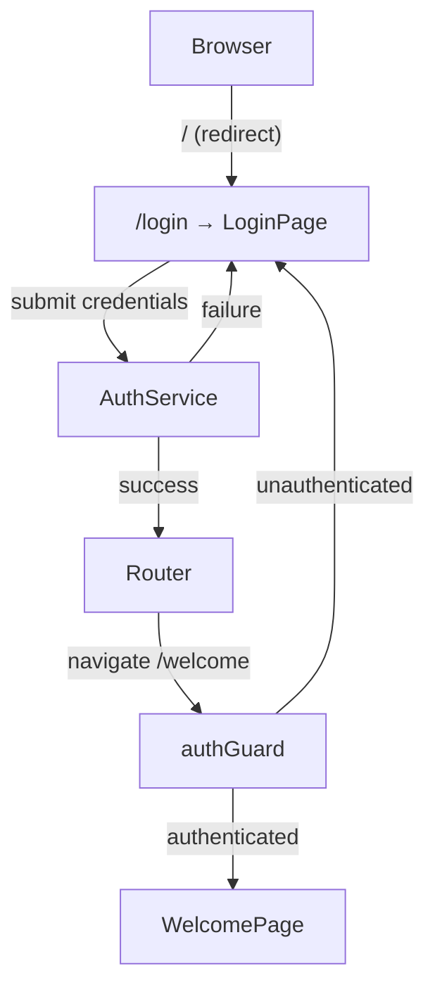
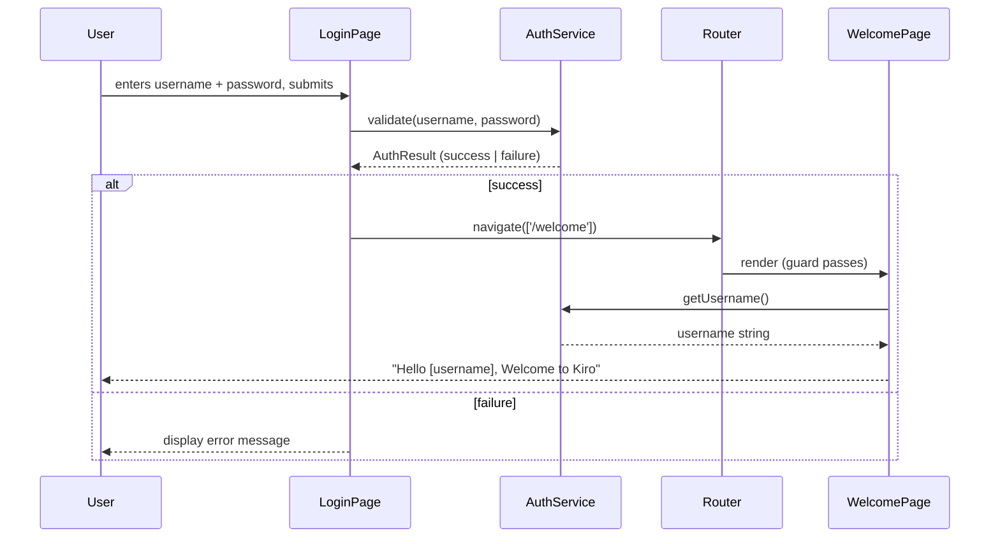

# Design Document: Login Page

## Overview

This document describes the technical design for adding a Login Page and Welcome Page to the MyFirstAngular application. The feature introduces credential-based authentication, route protection, and personalised post-login content — all delivered through Angular's router using lazy-loaded standalone components.

The design follows the Angular 20 standalone components API with no NgModules, strict TypeScript, and the project's established file-naming and folder conventions.

---

## Architecture

The feature introduces three new building blocks on top of the existing router shell:

1. **`AuthService`** — a singleton service (`providedIn: 'root'`) that owns all authentication state and credential validation logic. It is the single source of truth for whether a user is authenticated and who they are.
2. **`LoginPage` component** — a lazy-loaded standalone component rendered at `/login`. It owns the login form, delegates validation to `AuthService`, and drives navigation on success.
3. **`WelcomePage` component** — a lazy-loaded standalone component rendered at `/welcome`. It reads the authenticated username from `AuthService` and renders the personalised greeting.
4. **`authGuard`** — a functional route guard that protects `/welcome` by checking `AuthService` state and redirecting unauthenticated users to `/login`.



### Data Flow



---

## Components and Interfaces

### File Structure

```
src/app/
├── services/
│   └── auth.service.ts          # AuthService
├── login-page/
│   ├── login-page.ts            # LoginPage component
│   ├── login-page.html          # LoginPage template
│   └── login-page.css           # LoginPage styles
├── welcome-page/
│   ├── welcome-page.ts          # WelcomePage component
│   ├── welcome-page.html        # WelcomePage template
│   └── welcome-page.css         # WelcomePage styles
├── guards/
│   └── auth.guard.ts            # authGuard functional guard
├── app.routes.ts                # Updated with new routes
└── ...
```

### AuthService (`src/app/services/auth.service.ts`)

```typescript
@Injectable({ providedIn: 'root' })
export class AuthService {
  // Reactive auth state — BehaviorSubject so guards can subscribe
  private readonly authState = new BehaviorSubject<string | null>(null);

  /** Emits the authenticated username, or null when unauthenticated. */
  readonly currentUser$: Observable<string | null> = this.authState.asObservable();

  /** Returns the current username synchronously (for guard canActivate). */
  getCurrentUser(): string | null

  /**
   * Validates credentials against the Admin_Account.
   * Returns true on success, false on failure.
   * Blank (whitespace-only) username or password always returns false
   * without performing a string comparison.
   */
  validate(username: string, password: string): boolean

  /** Stores the authenticated username after a successful login. */
  login(username: string): void

  /** Clears authentication state (for session expiry / logout). */
  logout(): void
}
```

**Design decisions:**
- `BehaviorSubject<string | null>` is used so the guard can reactively respond to session expiry (Requirement 6.3) by subscribing to `currentUser$`.
- `validate()` is a pure synchronous function — no HTTP calls, no side effects. This makes it straightforward to unit-test and property-test.
- `login()` and `validate()` are intentionally separate: the component calls `validate()` first, then calls `login(username)` only on success. This keeps `AuthService` from having hidden side effects inside `validate()`.

### LoginPage (`src/app/login-page/`)

```typescript
@Component({
  selector: 'app-login-page',
  standalone: true,
  imports: [ReactiveFormsModule],
  templateUrl: './login-page.html',
  styleUrl: './login-page.css',
})
export class LoginPage {
  protected readonly form: FormGroup<{
    username: FormControl<string>;
    password: FormControl<string>;
  }>;

  protected errorMessage: string | null = null;

  constructor(
    private readonly authService: AuthService,
    private readonly router: Router,
  ) {}

  protected async onSubmit(): Promise<void>
}
```

**Template responsibilities:**
- Renders `<form>` with `(ngSubmit)="onSubmit()"`.
- Uses `@if (errorMessage)` to conditionally display the error banner.
- Labels use `for`/`id` pairing for accessibility.
- Password input has `type="password"`.
- Submit button has `type="submit"` and text "Login".

**Error clearing logic:**
- `errorMessage` is set to `null` at the start of every `onSubmit()` call (before `AuthService` responds), satisfying Requirement 4.4.
- `valueChanges` on the form group is subscribed to clear `errorMessage` whenever either field changes, satisfying Requirement 4.3.
- On failed auth, `errorMessage` is set and the username field value is preserved (password is intentionally left as-is since `FormControl` retains it; the requirement only mandates username preservation).

**Navigation failure handling:**
- `Router.navigate()` returns a `Promise<boolean>`. If it resolves to `false` or rejects, the component displays a navigation-failure error message (Requirement 3.3).

### WelcomePage (`src/app/welcome-page/`)

```typescript
@Component({
  selector: 'app-welcome-page',
  standalone: true,
  imports: [AsyncPipe],
  templateUrl: './welcome-page.html',
  styleUrl: './welcome-page.css',
})
export class WelcomePage {
  protected readonly greeting$: Observable<string>;

  constructor(private readonly authService: AuthService) {
    this.greeting$ = this.authService.currentUser$.pipe(
      map(user => user
        ? `Hello ${user}, Welcome to Kiro`
        : 'Hello Admin, Welcome to Kiro'
      )
    );
  }
}
```

**Template responsibilities:**
- Uses `@if (authService.getCurrentUser())` to guard display of the greeting (Requirement 5.3 — unauthenticated users should not see the personalised greeting; the guard handles redirect, but the component also defensively checks).
- Renders `{{ greeting$ | async }}` inside the guarded block.

### authGuard (`src/app/guards/auth.guard.ts`)

```typescript
export const authGuard: CanActivateFn = () => {
  const authService = inject(AuthService);
  const router = inject(Router);

  return authService.currentUser$.pipe(
    take(1),
    map(user => user !== null ? true : router.createUrlTree(['/login']))
  );
};
```

**Design decisions:**
- Functional guard (no class) — idiomatic Angular 14+ style.
- Returns a `UrlTree` for redirect rather than calling `router.navigate()` — this is the Angular-recommended pattern and avoids race conditions.
- Uses `take(1)` to complete after the first emission, preventing the guard from holding the observable open.
- For session expiry (Requirement 6.3): the guard runs on every navigation attempt. If `AuthService.logout()` is called (e.g., on token expiry), any subsequent navigation to `/welcome` will be redirected. For in-page expiry while already on `/welcome`, the component can subscribe to `currentUser$` and call `router.navigate(['/login'])` when it emits `null`.

### Route Configuration (`src/app/app.routes.ts`)

```typescript
export const routes: Routes = [
  { path: '', redirectTo: 'login', pathMatch: 'full' },
  {
    path: 'login',
    loadComponent: () =>
      import('./login-page/login-page').then(m => m.LoginPage),
  },
  {
    path: 'welcome',
    loadComponent: () =>
      import('./welcome-page/welcome-page').then(m => m.WelcomePage),
    canActivate: [authGuard],
  },
];
```

---

## Data Models

### AuthResult

`validate()` returns a plain `boolean` — `true` for success, `false` for failure. This is sufficient given the binary outcome and avoids over-engineering a discriminated union for a two-state result.

### Authentication State

```typescript
// Stored inside AuthService as BehaviorSubject<string | null>
// null  → unauthenticated
// string → authenticated username (e.g. 'admin')
type AuthState = string | null;
```

### Login Form Model

```typescript
interface LoginFormValue {
  username: string;
  password: string;
}
```

Managed by Angular's `ReactiveFormsModule` using typed `FormGroup<{ username: FormControl<string>; password: FormControl<string> }>`.

### Admin Account (compile-time constant)

```typescript
// Inside AuthService — not exported
const ADMIN_USERNAME = 'admin';
const ADMIN_PASSWORD = 'pwd';
```

---

## Correctness Properties

*A property is a characteristic or behavior that should hold true across all valid executions of a system — essentially, a formal statement about what the system should do. Properties serve as the bridge between human-readable specifications and machine-verifiable correctness guarantees.*

This feature contains pure logic in `AuthService.validate()` and display logic in `WelcomePage` that are well-suited to property-based testing. The UI interaction and routing behaviors are covered by example-based tests.

### Property 1: Credential Validation Correctness

*For any* username string and password string, `AuthService.validate(username, password)` SHALL return `true` if and only if `username === 'admin'` AND `password === 'pwd'`; it SHALL return `false` for every other combination, including blank or whitespace-only inputs in either field.

**Validates: Requirements 2.2, 2.3, 2.4, 2.5**

### Property 2: Username Preserved After Failed Login

*For any* non-empty username string submitted to the login form that results in a failed authentication response, the username input field SHALL still display that same username string after the failed submission completes.

**Validates: Requirements 4.1**

### Property 3: Input Change Dismisses Error

*For any* string value typed into the username input or the password input while an error message is displayed, the error message SHALL no longer be visible after the input value changes.

**Validates: Requirements 4.3**

### Property 4: Greeting Format Correctness

*For any* non-empty username string stored as the authenticated user, the greeting rendered by `WelcomePage` SHALL be exactly `"Hello [username], Welcome to Kiro"` where `[username]` is replaced by the stored username string.

**Validates: Requirements 5.1**

---

## Error Handling

### Authentication Failure
- `AuthService.validate()` returns `false` synchronously — no exceptions thrown.
- `LoginPage.onSubmit()` checks the return value and sets `errorMessage` to a user-facing string (e.g. `"Invalid username or password. Please try again."`).

### Navigation Failure (Requirement 3.3)
- `Router.navigate()` returns `Promise<boolean>`. The component `await`s this promise.
- If the result is `false`, or if the promise rejects, the component catches the error and sets `errorMessage` to a navigation-failure message (e.g. `"Navigation failed. Please try again."`).
- The component does not re-throw; it remains on the login view.

```typescript
protected async onSubmit(): Promise<void> {
  this.errorMessage = null; // clear before auth (Req 4.4)
  const { username, password } = this.form.getRawValue();
  const success = this.authService.validate(username, password);
  if (success) {
    this.authService.login(username);
    try {
      const navigated = await this.router.navigate(['/welcome']);
      if (!navigated) {
        this.errorMessage = 'Navigation failed. Please try again.';
      }
    } catch {
      this.errorMessage = 'Navigation failed. Please try again.';
    }
  } else {
    this.errorMessage = 'Invalid username or password. Please try again.';
  }
}
```

### Session Expiry on Welcome Page (Requirement 6.3)
- `WelcomePage` subscribes to `authService.currentUser$` in `ngOnInit`.
- When the observable emits `null` (session expired via `AuthService.logout()`), the component calls `this.router.navigate(['/login'])`.
- The subscription is cleaned up in `ngOnDestroy` using `takeUntilDestroyed()`.

### Unauthenticated Access to /welcome (Requirement 6.1)
- `authGuard` returns a `UrlTree` pointing to `/login`, which Angular Router handles as a redirect — no error is thrown or displayed.

---

## Testing Strategy

### Unit Tests (Karma + Jasmine)

**`AuthService`**
- Example: `validate('admin', 'pwd')` returns `true`.
- Example: `validate('admin', 'wrong')` returns `false`.
- Example: `validate('', 'pwd')` returns `false` (blank username).
- Example: `validate('admin', '')` returns `false` (blank password).
- Example: `validate('   ', 'pwd')` returns `false` (whitespace-only username).
- Example: `login('admin')` sets `getCurrentUser()` to `'admin'` and `currentUser$` emits `'admin'`.
- Example: `logout()` sets `getCurrentUser()` to `null` and `currentUser$` emits `null`.

**`LoginPage`**
- Example: form renders username input, password input, and submit button.
- Example: password input has `type="password"`.
- Example: submit button has `type="submit"` and text "Login".
- Example: labels are correctly associated with inputs via `for`/`id`.
- Example: submitting valid credentials calls `AuthService.validate` then `AuthService.login` then `Router.navigate(['/welcome'])`.
- Example: submitting invalid credentials displays error message.
- Example: error message is cleared at the start of re-submission (before auth response).
- Example: all form controls remain enabled while error is displayed.
- Example: `Router.navigate` returning `false` displays navigation-failure error.

**`WelcomePage`**
- Example: renders `"Hello admin, Welcome to Kiro"` when `currentUser$` emits `'admin'`.
- Example: renders `"Hello Admin, Welcome to Kiro"` when `currentUser$` emits `null`.
- Example: does not render personalised greeting when unauthenticated.

**`authGuard`**
- Example: returns `true` when `AuthService.getCurrentUser()` is non-null.
- Example: returns `UrlTree` for `/login` when `AuthService.getCurrentUser()` is `null`.

**Route configuration**
- Example: navigating to `/` redirects to `/login`.
- Example: navigating to `/welcome` without auth redirects to `/login`.
- Example: navigating to `/welcome` with auth renders `WelcomePage`.

### Property-Based Tests (Jasmine with `fast-check`)

The project uses Karma + Jasmine. The property-based testing library chosen is **[fast-check](https://fast-check.dev/)** — it integrates directly with Jasmine via `fc.assert(fc.property(...))` and requires no additional test runner configuration.

Each property test is configured to run a minimum of **100 iterations** (fast-check default is 100; this can be raised via `{ numRuns: 100 }` in `fc.assert`).

Each test is tagged with a comment referencing the design property:
`// Feature: login-page, Property N: <property text>`

**Property 1 — Credential Validation Correctness**
```typescript
// Feature: login-page, Property 1: validate returns true iff username==='admin' AND password==='pwd'
it('returns true only for exact admin credentials', () => {
  fc.assert(fc.property(
    fc.string(), fc.string(),
    (username, password) => {
      const expected = username === 'admin' && password === 'pwd';
      expect(service.validate(username, password)).toBe(expected);
    }
  ), { numRuns: 100 });
});
```

**Property 2 — Username Preserved After Failed Login**
```typescript
// Feature: login-page, Property 2: username field preserves value after failed login
it('preserves username after failed login for any username', () => {
  fc.assert(fc.property(
    fc.string({ minLength: 1 }),
    async (username) => {
      // set up component with invalid password
      component.form.setValue({ username, password: 'wrong' });
      await component.onSubmit();
      const input = fixture.nativeElement.querySelector('#username') as HTMLInputElement;
      expect(input.value).toBe(username);
    }
  ), { numRuns: 100 });
});
```

**Property 3 — Input Change Dismisses Error**
```typescript
// Feature: login-page, Property 3: typing any value into either field clears the error message
it('clears error message when any value is typed into username or password', () => {
  fc.assert(fc.property(
    fc.string(), fc.boolean(),
    (newValue, changeUsername) => {
      // trigger error state first
      component.errorMessage = 'some error';
      const control = changeUsername
        ? component.form.get('username')!
        : component.form.get('password')!;
      control.setValue(newValue);
      expect(component.errorMessage).toBeNull();
    }
  ), { numRuns: 100 });
});
```

**Property 4 — Greeting Format Correctness**
```typescript
// Feature: login-page, Property 4: greeting is "Hello [username], Welcome to Kiro" for any username
it('renders correct greeting format for any username', () => {
  fc.assert(fc.property(
    fc.string({ minLength: 1 }),
    (username) => {
      authServiceMock.currentUser$ = of(username);
      fixture.detectChanges();
      const el = fixture.nativeElement.querySelector('[data-testid="greeting"]') as HTMLElement;
      expect(el.textContent?.trim()).toBe(`Hello ${username}, Welcome to Kiro`);
    }
  ), { numRuns: 100 });
});
```

### Test File Locations

Following the project convention, test files live alongside their source:
- `src/app/services/auth.service.spec.ts`
- `src/app/login-page/login-page.spec.ts`
- `src/app/welcome-page/welcome-page.spec.ts`
- `src/app/guards/auth.guard.spec.ts`
